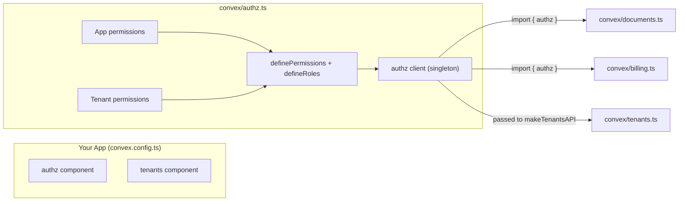

# @djpanda/convex-authz

A comprehensive, production-ready authorization component for [Convex](https://convex.dev) featuring **RBAC**, **ABAC**, and **ReBAC** with **O(1) indexed lookups**, inspired by [Google Zanzibar](https://research.google/pubs/pub48190/).

[](https://www.npmjs.com/package/@djpanda/convex-authz)
[](https://opensource.org/licenses/MIT)

## Features

| Feature | Description |
|---------|-------------|
| **RBAC** | Role-Based Access Control with scoped roles |
| **ABAC** | Attribute-Based Access Control with custom policies |
| **ReBAC** | Relationship-Based Access Control with graph traversal |
| **O(1) Lookups** | Pre-computed permissions for instant checks |
| **Type Safety** | Full TypeScript support with type-safe permissions |
| **Audit Logging** | Track all permission changes and checks |
| **Scoped Permissions** | Resource-level access control |
| **Expiring Grants** | Time-limited role assignments and permissions |
| **Convex Native** | Built specifically for Convex, with real-time updates |

## Terminology

| Term | Definition |
|------|------------|
| **RBAC** | Role-Based Access Control - permissions assigned via roles (admin, editor, viewer) |
| **ABAC** | Attribute-Based Access Control - permissions based on user/resource attributes (department=engineering) |
| **ReBAC** | Relationship-Based Access Control - permissions derived from relationships (member of team that owns resource) |
| **Zanzibar** | Google's global authorization system, inspiration for OpenFGA and this component |
| **Tuple** | A relationship triple: `(subject, relation, object)` e.g., `(user:alice, member, team:sales)` |
| **Scope** | Resource-level permission context, e.g., "admin of team:123" vs global "admin" |
| **Traversal** | Following relationship chains to determine inherited access |
| **O(1) Lookup** | Constant-time permission check via pre-computed indexes |
| **Permission Override** | Direct grant/deny that bypasses role-based permissions |

---

## Installation

```bash
npm install @djpanda/convex-authz
```

---

## Quick Start

### 1. Register the Component

```typescript
// convex/convex.config.ts
import { defineApp } from "convex/server";
import authz from "@djpanda/convex-authz/convex.config";

const app = defineApp();
app.use(authz);

export default app;
```

### 2. Define Your Permissions and Roles

```typescript
// convex/authz.ts
import { Authz, definePermissions, defineRoles } from "@djpanda/convex-authz";
import { components } from "./_generated/api";

// Step 1: Define permissions
const permissions = definePermissions({
  documents: {
    create: true,
    read: true,
    update: true,
    delete: true,
  },
  settings: {
    view: true,
    manage: true,
  },
});

// Step 2: Define roles
const roles = defineRoles(permissions, {
  admin: {
    documents: ["create", "read", "update", "delete"],
    settings: ["view", "manage"],
  },
  editor: {
    documents: ["create", "read", "update"],
    settings: ["view"],
  },
  viewer: {
    documents: ["read"],
  },
});

// Step 3: Create the authz client
export const authz = new Authz(components.authz, { permissions, roles });
```

### 3. Use in Your Functions

```typescript
// convex/documents.ts
import { mutation, query } from "./_generated/server";
import { v } from "convex/values";
import { authz } from "./authz";
import { getAuthUserId } from "@convex-dev/auth/server";

export const updateDocument = mutation({
  args: { docId: v.id("documents"), content: v.string() },
  handler: async (ctx, args) => {
    const userId = await getAuthUserId(ctx);
    
    // Check permission (throws if denied)
    await authz.require(ctx, userId, "documents:update");
    
    // Or with scope
    await authz.require(ctx, userId, "documents:update", {
      type: "document",
      id: args.docId,
    });
    
    // Proceed with update...
  },
});
```

---

## React integration

The package provides React hooks and a `PermissionGate` component so your UI can check permissions and roles reactively. Your app must expose Convex queries that wrap the Authz component (e.g. `checkPermission`, `getUserRoles`). The hooks call those queries via Convex’s `useQuery`, so permission and role changes stay up to date without polling.

### 1. Expose Convex queries

Define queries that delegate to your authz client, for example:

```typescript
// convex/app.ts (or similar)
import { query } from "./_generated/server";
import { v } from "convex/values";
import { authz } from "./authz";

export const checkPermission = query({
  args: {
    userId: v.string(),
    permission: v.string(),
    scope: v.optional(v.object({ type: v.string(), id: v.string() })),
  },
  handler: async (ctx, args) => {
    return authz.can(ctx, args.userId, args.permission, args.scope);
  },
});

export const getUserRoles = query({
  args: {
    userId: v.string(),
    scope: v.optional(v.object({ type: v.string(), id: v.string() })),
  },
  handler: async (ctx, args) => {
    return authz.getUserRoles(ctx, args.userId, args.scope);
  },
});
```

### 2. Wrap your app with AuthzProvider

Pass your Convex query refs (and optionally a default user id) to the provider:

```tsx
import { AuthzProvider } from "@djpanda/convex-authz/react";
import { api } from "./convex/_generated/api";

<AuthzProvider
  queryRefs={{
    checkPermission: api.app.checkPermission,
    getUserRoles: api.app.getUserRoles,
  }}
  defaultUserId={currentUserId}  // optional; hooks can pass userId in options
>
  <App />
</AuthzProvider>
```

### 3. Use hooks and PermissionGate

- **useCanUser(permission, options?)** — Returns `{ allowed, isLoading, error }`. Options: `{ userId?, scope? }`. Uses `defaultUserId` from the provider when `userId` is omitted.
- **useUserRoles(options?)** — Returns `{ roles, isLoading, error }`. Options: `{ userId?, scope? }`.
- **useRequirePermission(permission, options?)** — Throws when the user is not allowed (use an error boundary to show a denied state).
- **PermissionGate** — Renders `children` when allowed, `fallback` when denied, and `loadingFallback` (optional) while loading.

```tsx
import {
  useCanUser,
  useUserRoles,
  useRequirePermission,
  PermissionGate,
} from "@djpanda/convex-authz/react";

function DocumentList() {
  const { allowed, isLoading } = useCanUser("documents:read");

  if (isLoading) return <Spinner />;
  if (!allowed) return <p>You cannot view documents.</p>;
  return <div>{/* list */}</div>;
}

function AdminPanel() {
  useRequirePermission("settings:manage"); // throws if denied; wrap in error boundary
  return <div>Admin content</div>;
}

function EditButton({ docId }: { docId: string }) {
  return (
    <PermissionGate
      permission="documents:update"
      scope={{ type: "document", id: docId }}
      fallback={<span>No access</span>}
      loadingFallback={<span>Checking…</span>}
    >
      <button>Edit</button>
    </PermissionGate>
  );
}
```

Convex’s reactivity ensures that when permissions or roles change on the backend, the hooks and `PermissionGate` re-run and the UI updates automatically.

---

## Architecture

```
┌─────────────────────────────────────────────────────────────────────────────┐
│                           @djpanda/convex-authz                             │
├─────────────────────────────────────────────────────────────────────────────┤
│                                                                              │
│  ┌──────────────────┐  ┌──────────────────┐  ┌──────────────────────────┐   │
│  │      RBAC        │  │      ABAC        │  │         ReBAC            │   │
│  │  Role-Based      │  │  Attribute-Based │  │  Relationship-Based      │   │
│  │                  │  │                  │  │                          │   │
│  │  • Roles         │  │  • User attrs    │  │  • Tuples (S, R, O)      │   │
│  │  • Permissions   │  │  • Policies      │  │  • Graph traversal      │   │
│  │  • Scopes        │  │  • Conditions    │  │  • Inheritance          │   │
│  └──────────────────┘  └──────────────────┘  └──────────────────────────┘   │
│           │                    │                         │                   │
│           ▼                    ▼                         ▼                   │
│  ┌──────────────────────────────────────────────────────────────────────┐   │
│  │                    O(1) Indexed Permission Cache                      │   │
│  │                                                                       │   │
│  │   effectivePermissions  │  effectiveRoles  │  effectiveRelationships │   │
│  │   [user, perm, scope]   │  [user, role]    │  [subject, rel, object] │   │
│  └──────────────────────────────────────────────────────────────────────┘   │
│                                                                              │
└─────────────────────────────────────────────────────────────────────────────┘
```

---

## RBAC (Role-Based Access Control)

### Assigning Roles

```typescript
// Global role
await authz.assignRole(ctx, userId, "admin");

// Scoped role (e.g., admin of a specific team)
await authz.assignRole(ctx, userId, "admin", {
  type: "team",
  id: "team_123",
});

// With expiration (24 hours)
await authz.assignRole(ctx, userId, "admin", undefined, Date.now() + 86400000);
```

### Revoking Roles

```typescript
await authz.revokeRole(ctx, userId, "admin");

// Scoped
await authz.revokeRole(ctx, userId, "admin", { type: "team", id: "team_123" });
```

### Checking Permissions

```typescript
// Boolean check
const canEdit = await authz.can(ctx, userId, "documents:update");

// Throws if denied
await authz.require(ctx, userId, "documents:update");

// With scope
const canEditTeamDocs = await authz.can(ctx, userId, "documents:update", {
  type: "team",
  id: "team_123",
});
```

### Checking Roles

```typescript
const isAdmin = await authz.hasRole(ctx, userId, "admin");

// Scoped
const isTeamAdmin = await authz.hasRole(ctx, userId, "admin", {
  type: "team",
  id: "team_123",
});
```

### Getting User Roles

```typescript
const roles = await authz.getUserRoles(ctx, userId);
// Returns: [{ role: "admin", scope: undefined }, { role: "editor", scope: { type: "team", id: "123" } }]
```

---

## ABAC (Attribute-Based Access Control)

### Setting User Attributes

```typescript
await authz.setAttribute(ctx, userId, "department", "engineering");
await authz.setAttribute(ctx, userId, "clearanceLevel", 5);
await authz.setAttribute(ctx, userId, "location", { country: "US", state: "CA" });
```

### Getting Attributes

```typescript
const attributes = await authz.getUserAttributes(ctx, userId);
// Returns: [{ key: "department", value: "engineering" }, { key: "clearanceLevel", value: 5 }]
```

### Defining Policies

```typescript
import { definePolicies } from "@djpanda/convex-authz";

const policies = definePolicies({
  "documents:update": {
    // User can update if they own the document
    condition: (ctx) => ctx.resource?.ownerId === ctx.subject.userId,
    message: "Only document owners can update",
  },
  "reports:view": {
    // Only engineering department with clearance >= 3
    condition: (ctx) => 
      ctx.subject.attributes.department === "engineering" &&
      (ctx.subject.attributes.clearanceLevel as number) >= 3,
    message: "Requires engineering department with clearance level 3+",
  },
});

const authz = new Authz(components.authz, { permissions, roles, policies });
```

### Policy Context

Policies receive a context object with:

```typescript
interface PolicyContext {
  subject: {
    userId: string;
    roles: string[];
    attributes: Record<string, unknown>;
  };
  resource?: {
    type: string;
    id: string;
    [key: string]: unknown; // Resource data
  };
  action: string; // The permission being checked
}
```

---

## ReBAC (Relationship-Based Access Control)

ReBAC enables access control based on relationships between entities, perfect for hierarchical systems like CRMs, document sharing, and organizational structures.

### Relationship Model

Relationships are stored as tuples: `(subject, relation, object)`

```
user:alice  ──member──►  team:sales
team:sales  ──owner──►   account:acme
account:acme ──parent──► deal:big_deal
```

### Adding Relationships

```typescript
import { components } from "./_generated/api";

// User is member of team
await ctx.runMutation(components.authz.rebac.addRelation, {
  subjectType: "user",
  subjectId: "alice",
  relation: "member",
  objectType: "team",
  objectId: "sales",
});

// Team owns account
await ctx.runMutation(components.authz.rebac.addRelation, {
  subjectType: "team",
  subjectId: "sales",
  relation: "owner",
  objectType: "account",
  objectId: "acme",
});
```

### Checking Direct Relationships

```typescript
const isMember = await ctx.runQuery(components.authz.rebac.hasDirectRelation, {
  subjectType: "user",
  subjectId: "alice",
  relation: "member",
  objectType: "team",
  objectId: "sales",
});
// Returns: true
```

### Relationship Traversal (Inherited Access)

The real power of ReBAC is checking access through relationship chains:

```typescript
// Define how permissions flow through relationships
const traversalRules = {
  // A deal viewer is anyone who can view the parent account
  "deal:viewer": [
    { through: "account", via: "parent", inherit: "viewer" }
  ],
  // An account viewer is any member of the owning team
  "account:viewer": [
    { through: "team", via: "owner", inherit: "member" }
  ],
};

// Check: Can alice view big_deal?
const result = await ctx.runQuery(components.authz.rebac.checkRelationWithTraversal, {
  subjectType: "user",
  subjectId: "alice",
  relation: "viewer",
  objectType: "deal",
  objectId: "big_deal",
  traversalRules,
  maxDepth: 5,
});

// Returns:
// {
//   allowed: true,
//   path: [
//     "account:acme -[parent]-> deal:big_deal",
//     "team:sales -[owner]-> account:acme",
//     "user:alice -[member]-> team:sales"
//   ],
//   reason: "Access via relationship chain"
// }
```

Traversal uses a **maxDepth** limit (default 5) and tracks visited `(objectType, objectId, relation)` nodes so that circular relationships do not cause infinite loops.

### CRM Example

```typescript
// Setup CRM hierarchy
const setupCRM = async (ctx) => {
  // Sales rep Alice is on sales team
  await addRelation(ctx, "user", "alice", "member", "team", "sales");
  
  // Sales team owns Acme Corp account
  await addRelation(ctx, "team", "sales", "owner", "account", "acme_corp");
  
  // Acme Corp has a big deal
  await addRelation(ctx, "account", "acme_corp", "parent", "deal", "big_deal");
  
  // Now Alice can access the deal through the relationship chain!
};
```

---

## O(1) Indexed Lookups

For high-performance production use, the indexed system pre-computes permissions for instant lookups.

### Using the Indexed API

```typescript
import { IndexedAuthz } from "@djpanda/convex-authz";
import { components } from "./_generated/api";

const authz = new IndexedAuthz(components.authz, { permissions, roles });

// O(1) permission check - single index lookup
const canEdit = await authz.can(ctx, userId, "documents:update");

// O(1) role check
const isAdmin = await authz.hasRole(ctx, userId, "admin");

// O(1) relationship check
const isMember = await authz.hasRelation(ctx, "user", userId, "member", "team", "sales");
```

### How It Works

```
Traditional (O(n)):                    Indexed (O(1)):
┌──────┐                               ┌──────┐
│ User │                               │ User │
└──┬───┘                               └──┬───┘
   │                                      │
   ▼                                      ▼
┌──────────┐                           ┌─────────────────────────────┐
│ Get Roles│ ◄── Query                 │ Index Lookup:               │
└──┬───────┘                           │ effectivePermissions        │
   │                                   │ [userId, permission, scope] │
   ▼                                   └─────────────────────────────┘
┌───────────────┐                                  │
│ Expand Perms  │ ◄── Loop                         ▼
└──┬────────────┘                              true/false
   │
   ▼
┌──────────────┐
│ Check Each   │ ◄── Loop
│ Permission   │
└──┬───────────┘
   │
   ▼
true/false
```

### Trade-offs

| Operation | Traditional | Indexed |
|-----------|------------|---------|
| Permission Check | O(roles × perms) | **O(1)** |
| Role Assignment | O(1) | O(permissions) |
| Permission Grant | O(1) | O(1) |
| Memory Usage | Lower | Higher (denormalized) |

**Use Indexed for production workloads with many permission checks.**

---

## Audit Logging

All authorization changes are logged for compliance and debugging.

### Automatic Logging

The following actions are automatically logged:
- `role_assigned` - When a role is assigned
- `role_revoked` - When a role is revoked
- `permission_granted` - When a direct permission is granted
- `permission_denied` - When a permission is explicitly denied
- `attribute_set` - When a user attribute is set
- `attribute_removed` - When a user attribute is removed
- `permission_check` - (Optional) When permissions are checked

### Querying the Audit Log

```typescript
// Get all logs for a user
const logs = await authz.getAuditLog(ctx, {
  userId: "user_123",
  limit: 50,
});

// Get logs by action type
const roleChanges = await authz.getAuditLog(ctx, {
  action: "role_assigned",
  limit: 100,
});
```

### Log Entry Structure

```typescript
{
  _id: "...",
  timestamp: 1704672000000,
  actorId: "admin_user",  // Who made the change
  action: "role_assigned",
  userId: "target_user",  // Who was affected
  details: {
    role: "editor",
    scope: { type: "team", id: "team_123" },
  },
}
```

---

## Permission Overrides

Grant or deny specific permissions that override role-based assignments.

### Granting Permissions

```typescript
// Grant a permission directly (bypasses role checks)
await authz.grantPermission(ctx, userId, "documents:delete", undefined, "Temporary access for migration");

// With scope
await authz.grantPermission(ctx, userId, "documents:delete", { type: "team", id: "team_123" });

// With expiration
await authz.grantPermission(ctx, userId, "documents:delete", undefined, "Temporary", Date.now() + 3600000);
```

### Denying Permissions

```typescript
// Deny a permission (even if user has it via role)
await authz.denyPermission(ctx, userId, "documents:delete", undefined, "Access restricted");
```

---

## Schema Reference

### Tables

| Table | Purpose |
|-------|---------|
| `roleAssignments` | User role assignments |
| `userAttributes` | User attributes for ABAC |
| `permissionOverrides` | Direct permission grants/denials |
| `relationships` | ReBAC relationship tuples |
| `effectivePermissions` | Pre-computed permissions (O(1)) |
| `effectiveRoles` | Pre-computed roles (O(1)) |
| `effectiveRelationships` | Pre-computed relationships (O(1)) |
| `auditLog` | Authorization audit trail |

### Indexes

All tables have optimized indexes for common query patterns:

```typescript
// roleAssignments
.index("by_user", ["userId"])
.index("by_role", ["role"])
.index("by_user_and_role", ["userId", "role"])

// effectivePermissions (O(1) lookup)
.index("by_user_permission_scope", ["userId", "permission", "scopeKey"])

// relationships
.index("by_subject_relation_object", ["subjectType", "subjectId", "relation", "objectType", "objectId"])
```

---

## API Reference

### Authz Client

```typescript
class Authz<P, R, Policy> {
  // Permission checks
  can(ctx, userId, permission, scope?): Promise<boolean>
  require(ctx, userId, permission, scope?): Promise<void>
  
  // Role management
  hasRole(ctx, userId, role, scope?): Promise<boolean>
  assignRole(ctx, userId, role, scope?, expiresAt?, actorId?): Promise<string>
  revokeRole(ctx, userId, role, scope?, actorId?): Promise<boolean>
  getUserRoles(ctx, userId, scope?): Promise<Role[]>
  getUserPermissions(ctx, userId, scope?): Promise<PermissionResult>
  
  // Attribute management
  setAttribute(ctx, userId, key, value, actorId?): Promise<string>
  removeAttribute(ctx, userId, key, actorId?): Promise<boolean>
  getUserAttributes(ctx, userId): Promise<Attribute[]>
  
  // Permission overrides
  grantPermission(ctx, userId, permission, scope?, reason?, expiresAt?, actorId?): Promise<string>
  denyPermission(ctx, userId, permission, scope?, reason?, expiresAt?, actorId?): Promise<string>
  
  // Audit
  getAuditLog(ctx, options?): Promise<AuditEntry[]>
}
```

### IndexedAuthz Client (O(1))

```typescript
class IndexedAuthz<P, R> {
  // O(1) checks
  can(ctx, userId, permission, scope?): Promise<boolean>
  require(ctx, userId, permission, scope?): Promise<void>
  hasRole(ctx, userId, role, scope?): Promise<boolean>
  hasRelation(ctx, subjectType, subjectId, relation, objectType, objectId): Promise<boolean>
  
  // Batch queries
  getUserPermissions(ctx, userId, scope?): Promise<Permission[]>
  getUserRoles(ctx, userId, scope?): Promise<Role[]>
  
  // Mutations (compute on write)
  assignRole(ctx, userId, role, scope?, expiresAt?, assignedBy?): Promise<string>
  revokeRole(ctx, userId, role, scope?): Promise<boolean>
  grantPermission(ctx, userId, permission, scope?, reason?, expiresAt?, grantedBy?): Promise<string>
  denyPermission(ctx, userId, permission, scope?, reason?, expiresAt?, deniedBy?): Promise<string>
  
  // ReBAC
  addRelation(ctx, subjectType, subjectId, relation, objectType, objectId, inheritedRelations?, createdBy?): Promise<string>
  removeRelation(ctx, subjectType, subjectId, relation, objectType, objectId): Promise<boolean>
}
```

### Argument validation

All public methods on `Authz` and `IndexedAuthz` validate their arguments before calling the component. Invalid inputs throw an `Error` with a clear message so you can fail fast and fix call sites.

| Argument | Rule | Example error |
|----------|------|----------------|
| `userId` | Non-empty string, max 512 characters | `"userId must be a non-empty string"` |
| `permission` | Must be `resource:action` (e.g. `documents:read`) | `"Invalid permission format: \"read\". Expected \"resource:action\""` |
| `scope` | When provided, `type` and `id` must be non-empty strings | `"scope must have non-empty type when provided"` |
| `role` | Non-empty string; must be one of the roles passed at construction | `"Unknown role: \"superadmin\""` |
| `expiresAt` | When provided, must be a finite number (timestamp) | `"expiresAt must be a finite number"` |
| Attribute `key` | Non-empty string | `"Attribute key must be a non-empty string"` |
| `getAuditLog` `limit` | When provided, positive integer 1–1000 | `"limit must be a positive integer when provided"` |
| Relation args | `subjectType`, `subjectId`, `relation`, `objectType`, `objectId` must be non-empty strings | `"subjectType must be a non-empty string"` |

Optional parameters are only validated when present (e.g. omitting `scope` is valid; passing `scope: { type: "", id: "x" }` throws).

---

## Inspired by Google Zanzibar

This component implements concepts from [Google Zanzibar](https://research.google/pubs/pub48190/), Google's global authorization system that powers Google Drive, YouTube, Cloud, and more.

### Zanzibar Concepts Implemented

| Zanzibar Concept | Our Implementation | Description |
|------------------|-------------------|-------------|
| **Relation Tuples** | `relationships` table | `(user:alice, member, team:sales)` |
| **Usersets** | Traversal rules | Groups defined by relationships |
| **Check API** | `checkPermissionFast` | O(1) "can user X do Y on Z?" |
| **Expand API** | `checkRelationWithTraversal` | Find all paths granting access |
| **Read API** | `getSubjectRelations` | List all relationships |
| **Watch API** | Convex reactivity | Real-time permission updates |
| **Computed Relations** | `effectivePermissions` | Pre-computed for O(1) lookup |

### How Zanzibar Works

```
┌─────────────────────────────────────────────────────────────────────────────┐
│                        Google Zanzibar Model                                 │
├─────────────────────────────────────────────────────────────────────────────┤
│                                                                              │
│  Relation Tuples (stored):                                                  │
│  ┌────────────────────────────────────────────────────────────────────┐     │
│  │  (user:alice, member, team:sales)                                  │     │
│  │  (team:sales, owner, account:acme)                                 │     │
│  │  (account:acme, parent, deal:big_deal)                             │     │
│  └────────────────────────────────────────────────────────────────────┘     │
│                                                                              │
│  Authorization Model (defines inheritance):                                  │
│  ┌────────────────────────────────────────────────────────────────────┐     │
│  │  type deal                                                         │     │
│  │    relations                                                       │     │
│  │      define parent: [account]                                      │     │
│  │      define viewer: viewer from parent  ← Computed relation        │     │
│  └────────────────────────────────────────────────────────────────────┘     │
│                                                                              │
│  Check: "Can alice view deal:big_deal?"                                     │
│  ┌────────────────────────────────────────────────────────────────────┐     │
│  │  1. deal:big_deal.viewer = viewer from parent                      │     │
│  │  2. parent = account:acme                                          │     │
│  │  3. account:acme.viewer = member from owner                        │     │
│  │  4. owner = team:sales                                             │     │
│  │  5. team:sales.member includes user:alice ✓                        │     │
│  │  → ALLOWED                                                         │     │
│  └────────────────────────────────────────────────────────────────────┘     │
│                                                                              │
└─────────────────────────────────────────────────────────────────────────────┘
```

### Key Zanzibar Benefits We Provide

1. **Consistency at Scale**
   - Pre-computed permissions ensure fast, consistent checks
   - No permission drift between reads

2. **Flexible Permission Model**
   - Combine RBAC, ABAC, and ReBAC as needed
   - Support complex hierarchies (org → team → project → resource)

3. **Auditability**
   - Full audit log of all permission changes
   - Path tracing shows WHY access was granted

4. **Real-time Updates**
   - Convex reactivity means UI updates instantly when permissions change
   - No polling required (better than Zanzibar!)

---

## Comparison with Other Solutions

| Feature | @djpanda/convex-authz | OpenFGA | Oso | Cerbos |
|---------|------------------------|---------|-----|--------|
| RBAC | ✅ | ✅ | ✅ | ✅ |
| ABAC | ✅ | ⚠️ Limited | ✅ | ✅ |
| ReBAC | ✅ | ✅ Native | ✅ | ⚠️ |
| O(1) Lookups | ✅ | ✅ | ✅ | ✅ |
| Convex Native | ✅ | ❌ | ❌ | ❌ |
| Type Safety | ✅ TypeScript | DSL | Polar | YAML |
| Real-time | ✅ Convex queries | Polling | Polling | Polling |
| Self-hosted | ✅ | ✅ | ✅ | ✅ |

---

## Testing

### Running Package Tests

```bash
cd packages/authz
npm test
```

### Using with convex-test

```typescript
import { convexTest } from "convex-test";
import { describe, expect, it } from "vitest";
import schema from "./component/schema.js";
import { api } from "./component/_generated/api.js";

describe("authorization", () => {
  it("should assign and check roles", async () => {
    const t = convexTest(schema, modules);

    await t.mutation(api.mutations.assignRole, {
      userId: "user_123",
      role: "admin",
    });

    const hasRole = await t.query(api.queries.hasRole, {
      userId: "user_123",
      role: "admin",
    });

    expect(hasRole).toBe(true);
  });
});
```

---

## Best Practices

### 1. Use Scoped Roles for Multi-tenancy

```typescript
// Don't: Global admin
await authz.assignRole(ctx, userId, "admin");

// Do: Scoped admin
await authz.assignRole(ctx, userId, "admin", { type: "org", id: orgId });
```

### 2. Prefer O(1) Indexed API for Production

```typescript
// Development: Standard API (simpler)
const authz = new Authz(components.authz, { permissions, roles });

// Production: Indexed API (faster)
const authz = new IndexedAuthz(components.authz, { permissions, roles });
```

### 3. Use ReBAC for Complex Hierarchies

```typescript
// CRM, document sharing, org charts → ReBAC
// Simple role assignments → RBAC
```

### 4. Set Expiration for Temporary Access

```typescript
await authz.assignRole(ctx, userId, "contractor", undefined, 
  Date.now() + 30 * 24 * 60 * 60 * 1000 // 30 days
);
```

### 5. Always Use Audit Logging

The audit log is invaluable for:
- Compliance (SOC2, GDPR)
- Debugging access issues
- Security incident investigation

### 6. Cleanup of Expired Data (Scheduled via Component)

Expired role assignments and permission overrides (and their indexed rows) are purged by a **scheduled cleanup job** that you enable once—no need to add `convex/crons.ts` yourself. The component embeds [@convex-dev/crons](https://www.convex.dev/components/crons); run this **once** after installing the component to register the daily job:

```bash
npx convex run authz/cronSetup:ensureCleanupCronRegistered
```

Or from an init script that runs on deploy (e.g. `convex/init.ts` invoked via `convex dev --run init`):

```typescript
await ctx.runMutation(components.authz.cronSetup.ensureCleanupCronRegistered, {});
```

The job runs every 24 hours and cleans `roleAssignments`, `permissionOverrides`, `effectiveRoles`, and `effectivePermissions`. Optional: you can instead define the cleanup in your app's `convex/crons.ts` or run `components.authz.mutations.runScheduledCleanup` manually.

### 7. Use Authz as a Global Singleton

Authz is a **global component** — install it once and share a single client instance across your entire app. Do not create multiple `Authz` instances per app.

```
convex/
  convex.config.ts   ← app.use(authz) — registered once
  authz.ts           ← definePermissions, defineRoles, export authz client
  documents.ts       ← import { authz } from "./authz"
  billing.ts         ← import { authz } from "./authz"
  settings.ts        ← import { authz } from "./authz"
```

```typescript
// convex/authz.ts — single source of truth
import { Authz, definePermissions, defineRoles } from "@djpanda/convex-authz";
import { components } from "./_generated/api";

const permissions = definePermissions({
  documents: { create: true, read: true, update: true, delete: true },
  billing: { view: true, manage: true },
  settings: { view: true, manage: true },
});

const roles = defineRoles(permissions, {
  admin: {
    documents: ["create", "read", "update", "delete"],
    billing: ["view", "manage"],
    settings: ["view", "manage"],
  },
  viewer: {
    documents: ["read"],
    settings: ["view"],
  },
});

// Export the single authz client — import this everywhere
export const authz = new Authz(components.authz, { permissions, roles });
```

```typescript
// convex/documents.ts — uses the shared client
import { mutation } from "./_generated/server";
import { authz } from "./authz";

export const deleteDocument = mutation({
  args: { docId: v.id("documents") },
  handler: async (ctx, args) => {
    await authz.require(ctx, userId, "documents:delete");
    // ...
  },
});
```

### 7. Organize Permissions by Domain

In larger apps, split permission and role definitions by domain and merge them into a single authz client using `definePermissions` and `defineRoles`:

```typescript
// convex/permissions/documents.ts
export const documentPermissions = {
  documents: { create: true, read: true, update: true, delete: true },
};
export const documentRoles = {
  editor: { documents: ["create", "read", "update"] as const },
  viewer: { documents: ["read"] as const },
};

// convex/permissions/billing.ts
export const billingPermissions = {
  billing: { view: true, manage: true },
};
export const billingRoles = {
  billing_admin: { billing: ["view", "manage"] as const },
};
```

```typescript
// convex/authz.ts — merge all domains
import { Authz, definePermissions, defineRoles } from "@djpanda/convex-authz";
import { components } from "./_generated/api";
import { documentPermissions, documentRoles } from "./permissions/documents";
import { billingPermissions, billingRoles } from "./permissions/billing";

const permissions = definePermissions(documentPermissions, billingPermissions);
const roles = defineRoles(permissions, documentRoles, billingRoles);

export const authz = new Authz(components.authz, { permissions, roles });
```

This keeps each domain self-contained while producing a single, type-safe authz client.

### 8. Integrating with Other Convex Components

When other Convex components (e.g., `@djpanda/convex-tenants`) need authorization, they share the **same global authz instance**. The pattern:

1. Register both components independently in `convex.config.ts`
2. The other component exports its required permissions and roles
3. Merge them with your app's own definitions
4. Pass the authz client to the other component's API factory



```typescript
// convex/convex.config.ts — register both components
import { defineApp } from "convex/server";
import authz from "@djpanda/convex-authz/convex.config";
import tenants from "@djpanda/convex-tenants/convex.config";

const app = defineApp();
app.use(authz);
app.use(tenants);
export default app;
```

```typescript
// convex/authz.ts — merge app + component permissions
import { Authz, definePermissions, defineRoles } from "@djpanda/convex-authz";
import { TENANTS_PERMISSIONS, TENANTS_ROLES } from "@djpanda/convex-tenants";
import { components } from "./_generated/api";

// Your app's own permissions
const appPermissions = {
  documents: { create: true, read: true, update: true, delete: true },
};
const appRoles = {
  editor: { documents: ["create", "read", "update"] as const },
};

// Merge with tenant component's permissions
const permissions = definePermissions(appPermissions, TENANTS_PERMISSIONS);
const roles = defineRoles(permissions, appRoles, TENANTS_ROLES);

export const authz = new Authz(components.authz, { permissions, roles });
```

```typescript
// convex/tenants.ts — pass the shared authz client
import { makeTenantsAPI } from "@djpanda/convex-tenants";
import { components } from "./_generated/api";
import { authz } from "./authz";

export const {
  createOrg,
  inviteMember,
  removeMember,
  // ...
} = makeTenantsAPI(components.tenants, {
  authz,
  creatorRole: "owner",
  auth: async (ctx) => {
    // return the current user ID
  },
});
```

This way every part of your app — your own functions and third-party components — shares a single, consistent authorization layer.

---

## Development

```bash
# Install dependencies
npm install

# Run development mode
npm run dev

# Run tests
npm test

# Build for production
npm run build

# Type check
npm run typecheck
```

---

## File Structure

```
packages/authz/
├── package.json          # Package configuration
├── README.md             # This documentation
├── src/
│   ├── client/
│   │   ├── index.ts      # Main exports (Authz, IndexedAuthz, helpers)
│   │   └── index.test.ts # Client tests
│   ├── component/
│   │   ├── convex.config.ts  # Component registration
│   │   ├── schema.ts         # Database tables and indexes
│   │   ├── helpers.ts        # Shared utilities
│   │   ├── queries.ts        # Query functions
│   │   ├── mutations.ts      # Mutation functions
│   │   ├── rebac.ts          # ReBAC relationship functions
│   │   ├── indexed.ts        # O(1) indexed functions
│   │   ├── authz.test.ts     # RBAC/ABAC tests
│   │   ├── rebac.test.ts     # ReBAC tests
│   │   ├── indexed.test.ts   # O(1) indexed tests
│   │   └── _generated/       # Auto-generated types
│   └── test.ts           # Test helpers
└── example/              # Example app
```

---

## License

MIT

---

## Contributing

Contributions are welcome! Please read our [CONTRIBUTING.md](CONTRIBUTING.md) before submitting a PR.
